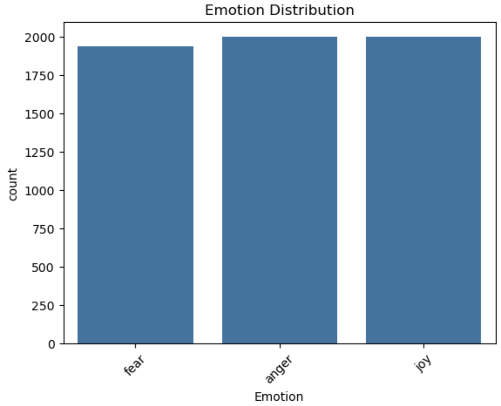
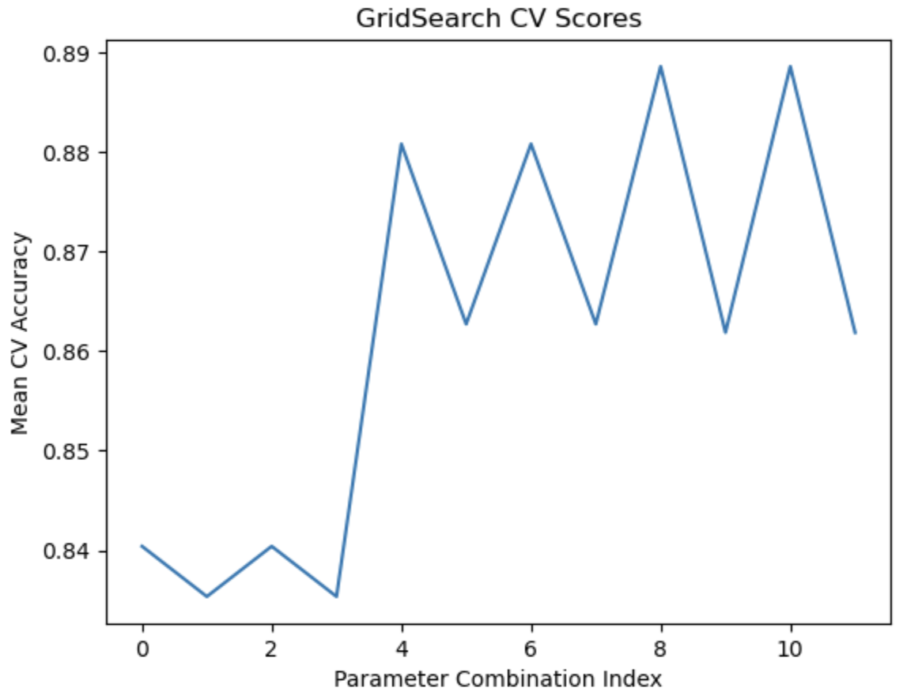

## Emotion Classification using Naive Bayes (with Pipeline & GridSearchCV)

## Project Overview

This project builds a Text Emotion Classification Model using:
	•	TF-IDF Vectorization
	•	Multinomial Naive Bayes
	•	Scikit-learn Pipeline
	•	GridSearchCV with 5-Fold Cross Validation

The model classifies text comments into different emotional categories.

## Tech Stack
	•	Python
	•	Pandas
	•	Scikit-learn
	•	Matplotlib
	•	Seaborn

## Project Workflow

1️⃣ Data Loading

	•	Dataset loaded using Pandas

2️⃣ Exploratory Data Analysis (EDA)

	•	Checked class distribution
	•	Visualized emotion frequency

3️⃣ Text Preprocessing

	•	Used TfidfVectorizer inside a Pipeline
	•	Converted text into numerical feature vectors

4️⃣ Model Building

Used:
	•	Multinomial Naive Bayes

Implemented using:

Pipeline([

    ('tfidf', TfidfVectorizer()),
    ('nb', MultinomialNB())
	
])

## Hyperparameter Tuning

Used GridSearchCV with 5-Fold Cross Validation

Tuned Parameters:

	•	tfidf__ngram_range
	•	tfidf__max_df
	•	nb__alpha

## Model Evaluation

	•	Cross Validation Score: ~0.89
	•	Test Accuracy: ~90%
	•	Confusion Matrix
	•	GridSearch CV Score Plot

## Visualizations

## 📈 Emotion Distribution

## GridSearch CV Score Plot

