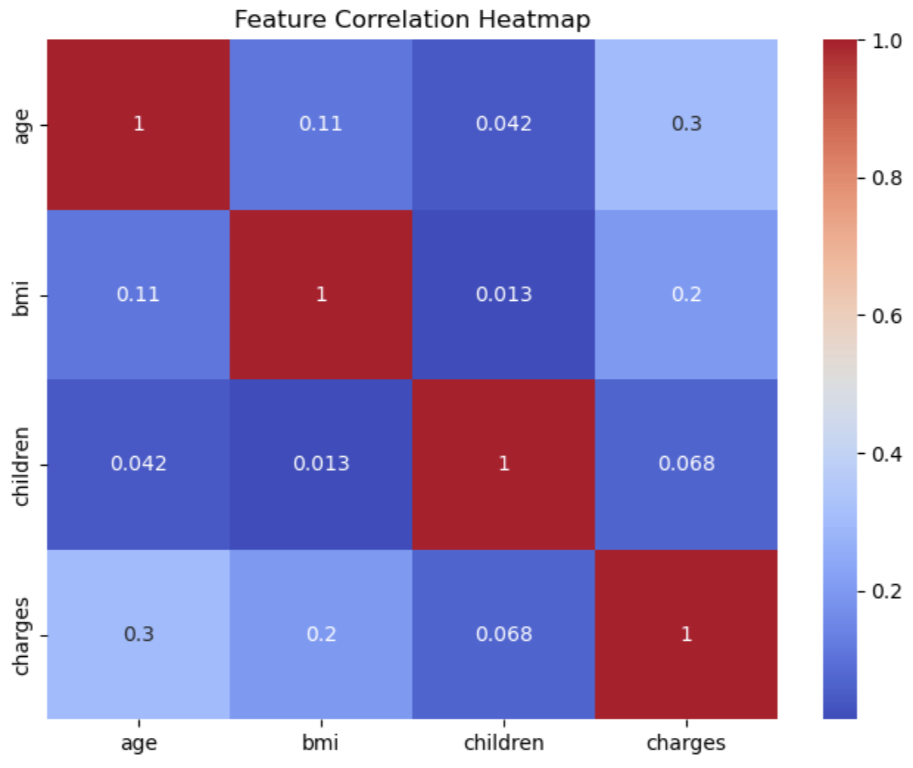
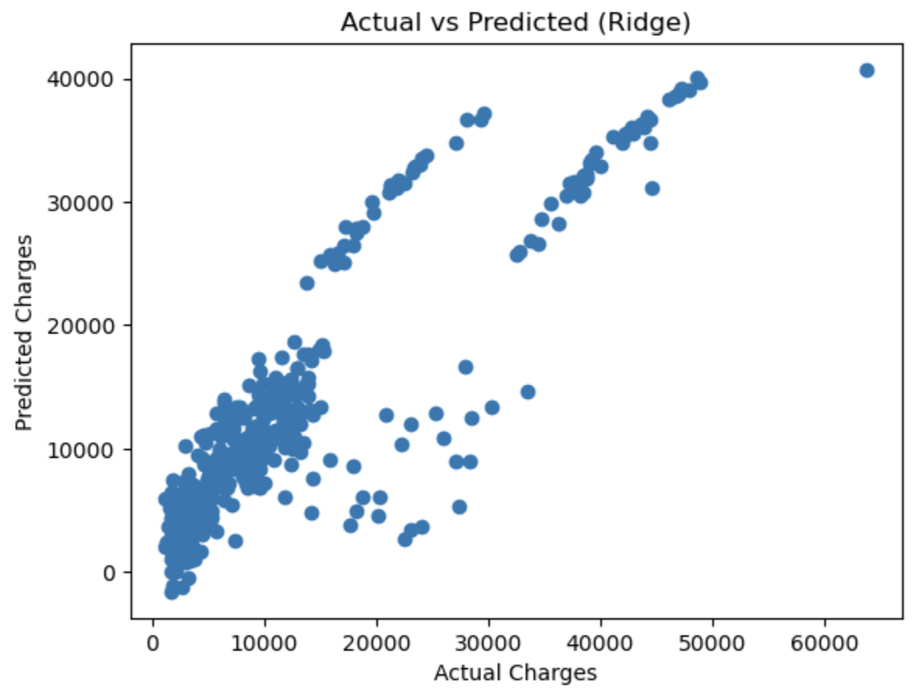

## 🏥 Medical Insurance Cost Prediction

Regularized Regression Analysis using Lasso & Ridge Models

This project demonstrates an end-to-end Machine Learning workflow to predict medical insurance charges. It explores the power of L1 (Lasso) and L2 (Ridge) regularization, utilizing Scikit-learn pipelines and automated hyperparameter tuning to find the most accurate prediction model.

## 🎯 Project Objective

The goal is to predict insurance charges based on demographic and health-related features while comparing the performance of regularized regression models to determine which handles the data's complexity more effectively.

## 📊 Dataset Overview

The model is trained on beneficiary data including:

• Numerical Features: age, bmi, children

• Categorical Features: sex, smoker, region

• Target Variable: charges (The total medical cost billed by health insurance)

## 🛠️ Machine Learning Workflow

The project implements a structured, production-ready pipeline:
1. Data Preprocessing: Handling categorical variables through encoding.
2. Feature Engineering: Creating interaction terms (e.g., bmi_smoker) to capture non-linear relationships.
3. Data Splitting: 70/30 Train-Test split for robust evaluation.
4. Pipeline Integration: * Standardization: Using StandardScaler to normalize features.
         • Modeling: Seamlessly connecting scaling to the regression estimator to prevent data leakage.
5. Hyperparameter Tuning: Using GridSearchCV to find the optimal \bm{\alpha} (regularization strength).
6. Evaluation: Comparing models using {R^2}, MSE, and RMSE.
 
## 🏆 Model Results

## Lasso Regression (L1)

• Best Alpha: 100

• R² Score: 0.7690

• RMSE: 5,819.58

## Ridge Regression (L2)

• Best Alpha: 10

• R² Score: 0.7692

• RMSE: 5,816.97

Note: Ridge Regression performed slightly better, suggesting that shrinking coefficients (L2) was more effective than the feature elimination (L1) approach for this specific dataset.

## 🖼️ Visualizations

## 1️⃣ Feature Correlation Heatmap

Identifies the strongest drivers of insurance costs, highlighting the massive impact of smoking status and age.

## 2️⃣ Actual vs. Predicted Charges (Ridge)

Visualizes how well the model's predictions align with reality.

## 🧰 Tech Stack & Skills

• Languages: Python

• Data Science: Pandas, NumPy

• Visualization: Matplotlib, Seaborn

• Machine Learning: Scikit-learn (Pipelines, GridSearchCV, Regularization)

## 💡 Skills Demonstrated

• ✅ Regularized Regression (L1 & L2)

• ✅ Advanced Feature Engineering

• ✅ Cross-Validation & Hyperparameter Tuning

• ✅ Data Standardization & Pipeline Construction

• ✅ Model Evaluation & Comparison
